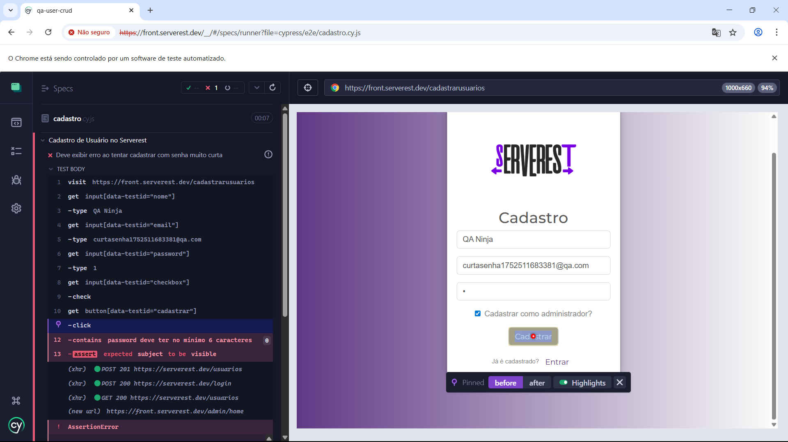
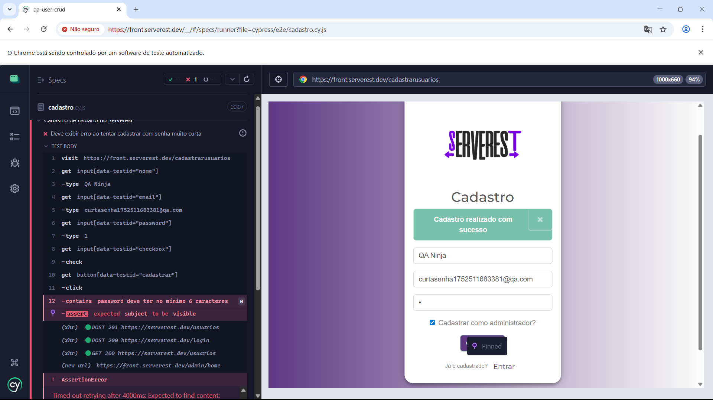

# 🐞 Bug Report: Cadastro aceita senha com menos de 6 caracteres

---

**📌 Título:** Campo de senha aceita menos de 6 caracteres no cadastro de usuário  
**📂 Tipo:** Bug  
**📈 Severidade:** Média  
**🔺 Prioridade:** Alta  
**⏳ Status:** Aberto  

---

## 🧪 Passos para reproduzir:

1. Acessar: [https://front.serverest.dev/cadastrarusuarios](https://front.serverest.dev/cadastrarusuarios)
2. Preencher:
   - Nome: QA Bug Test
   - Email: senha1char<timestamp>@qa.com
   - Senha: `1`
   - Marcar o checkbox “É administrador”
3. Clicar no botão **Cadastrar**

---

## ✅ Resultado esperado:

O sistema **deve exibir uma mensagem de erro** informando que a senha deve ter no mínimo 6 caracteres.  
O cadastro **não deve ser realizado**.

---

## ❌ Resultado atual:

Mensagem exibida:  
> _"Cadastro realizado com sucesso"_

O sistema aceita a senha com apenas um caractere e cadastra o usuário normalmente.

---

## 📷 Evidência:




> Exemplo de comando usado no teste:
```js
cy.get('input[data-testid="password"]').type('1');
