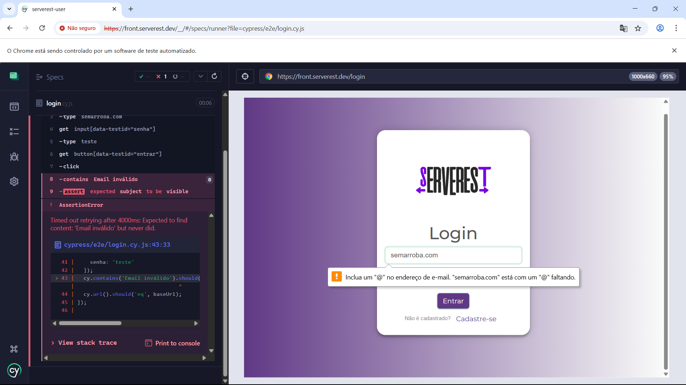
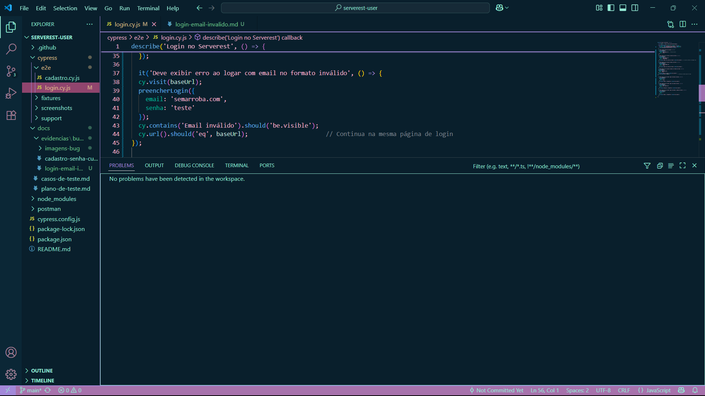

# Bug Report: Login aceita e-mail com formato inválido

## Descrição
Ao tentar realizar login com um e-mail em formato inválido (exemplo: `semarroba.com`), o sistema não exibe mensagem de erro adequada e permite a tentativa de login.

## Passos para reproduzir
1. Acessar a página de login: `https://front.serverest.dev/login`
2. Inserir um e-mail sem o caractere '@', por exemplo `semarroba.com`
3. Inserir qualquer senha válida
4. Clicar no botão "Entrar"

## Resultado esperado
O sistema deveria exibir uma mensagem de erro clara, por exemplo: "Email inválido" e impedir a tentativa de login.

## Resultado atual
O sistema permite a tentativa de login sem exibir mensagem de erro e sem impedir o envio do formulário.

## Impacto
Pode causar tentativas de login inválidas e confusão para o usuário, comprometendo a usabilidade e segurança da aplicação.

## Evidências

---

## Informações técnicas
- Data do teste: 14/07/2025
- Ambiente: Frontend Serverest
- Ferramenta: Cypress

---

## Sugestão de correção
Implementar validação de formato de e-mail no front-end e exibir mensagem de erro antes de permitir o envio do formulário.
